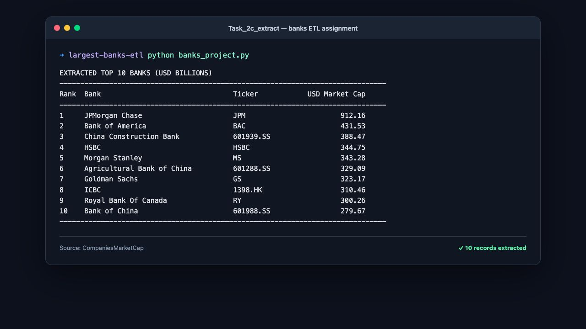

# World's Largest Banks ETL Assignment

This is a small data engineering assignment repository containing one Python script that runs the complete extract–transform–load workflow.

## Assignment deliverables

| File | Purpose |
|---|---|
| [`banks_project.py`](banks_project.py) | The single Python script for the complete ETL pipeline |
| [`exchange_rate.csv`](exchange_rate.csv) | USD-to-GBP, EUR, and INR exchange-rate input |
| [`Largest_banks_data.csv`](Largest_banks_data.csv) | Transformed CSV output |
| [`Banks.db`](Banks.db) | SQLite database containing table `Largest_banks` |
| [`code_log.txt`](code_log.txt) | Timestamped ETL execution log |
| [`Task_2c_extract.png`](Task_2c_extract.png) | Screenshot evidence of the top-ten extraction |

## ETL flow

1. **Extract** — download and parse the top ten banks by market capitalization from [CompaniesMarketCap](https://companiesmarketcap.com/banks/largest-banks-by-market-cap/).
2. **Transform** — convert each USD market cap to GBP, EUR, and INR billions using [`exchange_rate.csv`](exchange_rate.csv).
3. **Load** — write the transformed records to `Largest_banks_data.csv` and replace the `Largest_banks` table in `Banks.db`.
4. **Log** — record every ETL stage in `code_log.txt`.

Market capitalization changes with security prices. Each row includes the UTC extraction timestamp in `Data_As_Of_UTC`.

## Exchange rates

The exchange-rate CSV is derived from [European Central Bank reference rates](https://www.ecb.europa.eu/stats/policy_and_exchange_rates/euro_reference_exchange_rates/html/index.en.html) dated 16 July 2026. ECB values are quoted per euro and normalized to target-currency units per USD:

```text
target currency per USD = target currency per EUR / USD per EUR
```

ECB inputs were USD `1.1467`, GBP `0.84873`, EUR `1.0`, and INR `110.4895` per EUR. These reference rates are informational and are not intended for transaction settlement.

## Run the assignment

Python 3.10 or newer is recommended.

```bash
python -m venv .venv
source .venv/bin/activate
pip install -r requirements.txt
python banks_project.py
```

The script prints the extracted top-ten table, performs the currency conversions, writes both load targets, and appends execution events to `code_log.txt`.

## Inspect the database table

```bash
sqlite3 -header -column Banks.db \
  'SELECT Rank, Name, MC_USD_Billion, MC_GBP_Billion, MC_EUR_Billion, MC_INR_Billion FROM Largest_banks ORDER BY Rank;'
```

## Output columns

| Column | Meaning |
|---|---|
| `Rank` | Rank by market capitalization |
| `Name` | Bank or bank holding company |
| `Ticker` | Source listing ticker |
| `Country` | Source country |
| `MC_USD_Billion` | Market cap in USD billions |
| `MC_GBP_Billion` | Market cap in GBP billions |
| `MC_EUR_Billion` | Market cap in EUR billions |
| `MC_INR_Billion` | Market cap in INR billions |
| `Data_As_Of_UTC` | UTC extraction timestamp |

## Extraction screenshot


